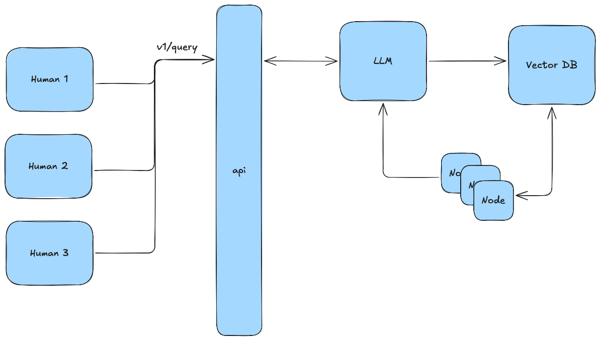

# RAG Query API System

A FastAPI-based RAG (Retrieval-Augmented Generation) system using Qdrant for vector storage and Azure OpenAI for embeddings and inference.

## Prerequisites

- Python 3.11+
- uv
- Docker
- Azure OpenAI API access
- Local Qdrant docker

## Setup

1. **Activate project local virtual environment**
   ```bash
   python -m venv .venv
   source .venv/bin/activate
   ```

2. **Install dependencies**
   ```bash
   uv install
   ```

3. **Environment Configuration**

   Create a `.env` file with your Azure OpenAI credentials (see .example.env for reference):
   ```env
   AZURE_OPENAI_API_KEY=your_api_key
   AZURE_OPENAI_ENDPOINT=your_endpoint
   ```

4. **Start Qdrant Vector Database**
   ```bash
   docker run -p 6333:6333 -p 6334:6334 -v $(pwd)/qdrant_storage:/qdrant/storage:z qdrant/qdrant
   ```

5. **Load Documents**
    Request documents from the team and place them in the `data/` directory, then run:
   ```bash
   python parse_documents.py
   ```

   This will process your documents and store them in Qdrant (see `parse_documents.py` for configuration options).

6. **Run the API**
   ```bash
   make run
   ```

   The API will be available at:
   - API Endpoint: http://localhost:8003/api/v1
   - Swagger Documentation: http://localhost:8003/docs
   - ReDoc Documentation: http://localhost:8003/redoc

## API Usage

Send queries to the RAG system using:
```bash
curl -X POST "http://localhost:8003/api/v1/query" \
     -H "Content-Type: application/json" \
     -d '{"query": "your question here"}'
```

## Project Structure

- `app/`: Main application code
  - `api/`: API endpoints
  - `core/`: Core configuration
  - `models/`: Pydantic models
- `data/`: Document storage directory
- `images/`: images for readme
- `parse_documents.py`: Document ingestion script

## Development

For development, use:
```bash
make run
```

This will start the server in development mode with auto-reload enabled.

## Current functionality

Current functionality with query endpoint is illustrated here.


